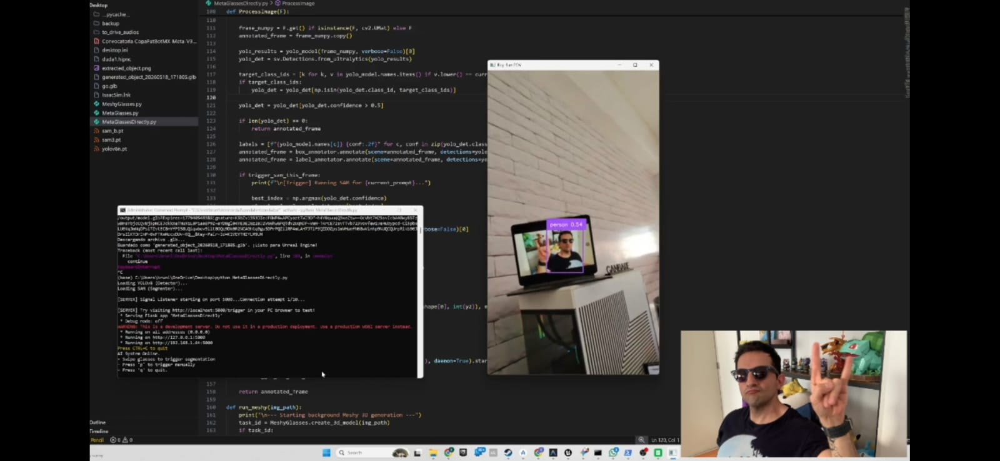
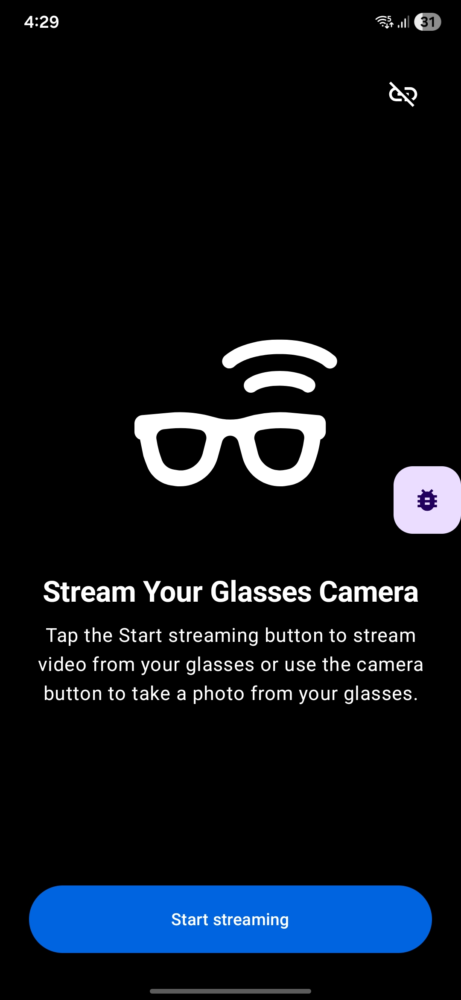
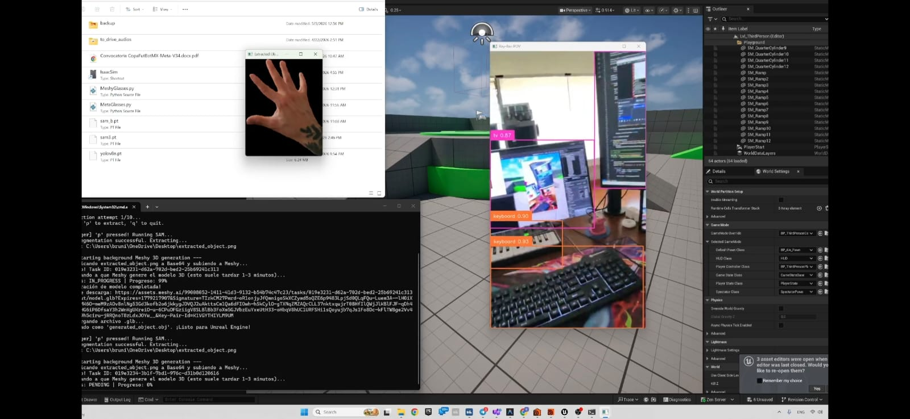
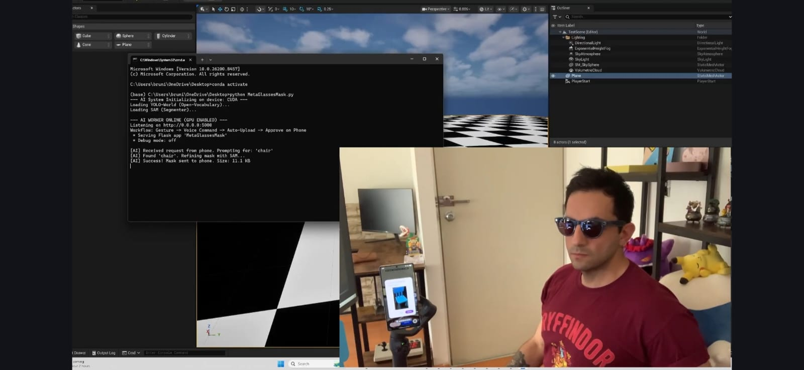
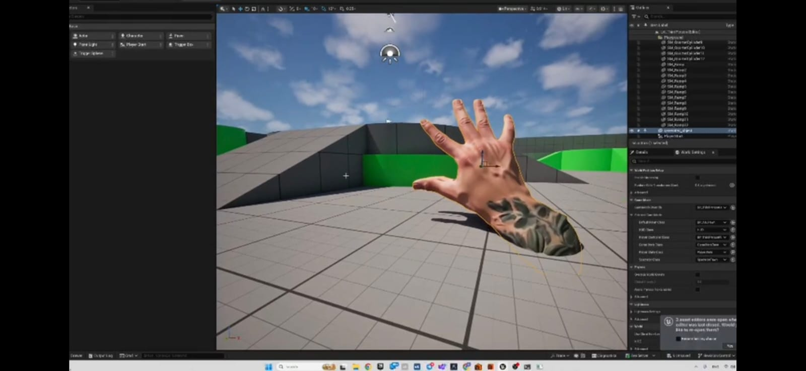
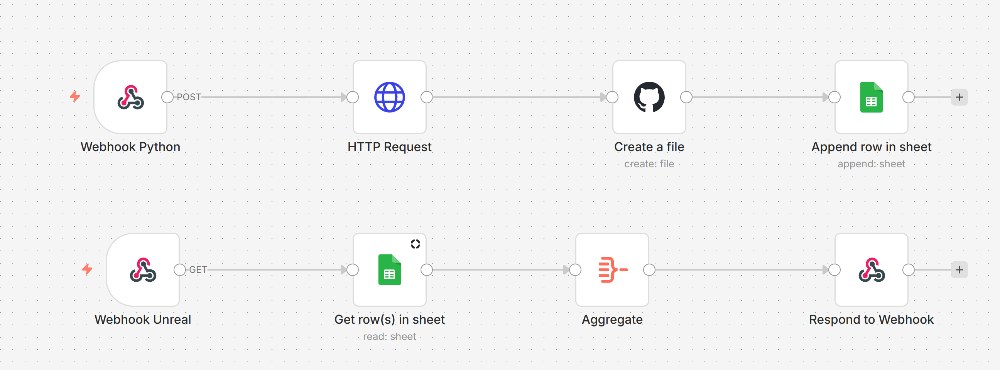
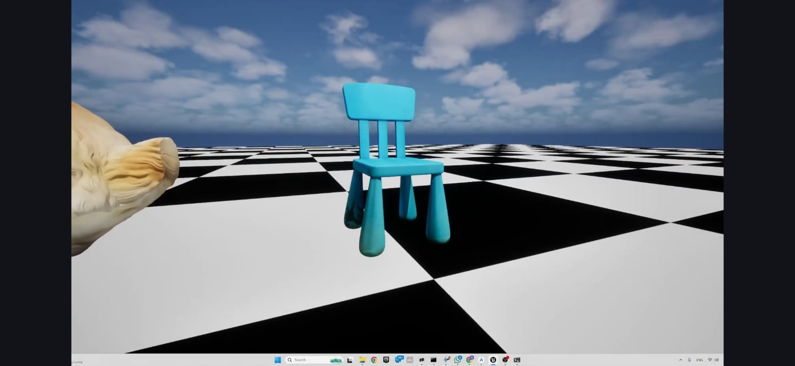

# Meta Ray-Ban to Unreal Engine: Voice-Activated 3D Object Spawning

This repository contains an end-to-end computer vision and spatial computing pipeline. It allows you to use a pair of Meta Ray-Ban smart glasses to capture real-world objects, segment them via voice commands, generate 3D models using AI, and spawn them dynamically at runtime in Unreal Engine.

## Pipeline Overview

### 1. Streaming the Meta Ray-Ban Feed

  

The pipeline begins with a custom Android app built in Kotlin. Communicating via Bluetooth, the app pulls the camera feed from the Meta Ray-Ban glasses and hosts an MJPEG stream on a local web server (port 8080). A Python script connects to this server, extracting the MJPEG frames to visualize the live feed in real-time using OpenCV.

### 2. Object Segmentation (YOLOv8 & SAM)

Originally relying on YOLOv8 for 80-category bounding box detection, the pipeline evolved to use the Segment Anything Model (SAM) directly via text prompts. By swiping the volume sensor on the glasses, the Android app records a 3-second voice command (e.g., "Segment the coffee mug"). This transcribed text and the current video frame are sent to the Python server, which prompts SAM to generate a clean segmentation mask of the requested object.

### 3. AI 3D Generation (Meshy API)

Once the object is successfully segmented, the Python backend fires the cropped, clean image to the Meshy API. Meshy's Image-to-3D service processes the image and generates a fully textured `.glb` 3D model.

### 4. Agentic Workflow (n8n & GitHub)

The Python script sends a POST webhook containing the Meshy download link to **n8n**. The n8n workflow catches the webhook, downloads the `.glb` file, pushes the raw data to a GitHub repository, and logs the raw download URL into a Google Sheet.

### 5. Unreal Engine Runtime Spawning

Using a custom Blueprint event in Unreal Engine, the game queries the Google Sheet. It iterates through the rows of GitHub raw `.glb` links, downloads them using the `gltf-runtime` plugin, and dynamically spawns them as actors in the scene. 

## Structure
*(In a Monorepo setup, your Android, Python, and Unreal Engine environments will be organized in top-level directories).*

## Author
**Brunirows Code**  
Spatial Computing, Computer Vision & AI Engineer  

## License & Disclaimer
This project is licensed under the MIT License - see the [LICENSE](LICENSE) file for details.

**Disclaimer:** This project utilizes the [Meta Wearables Device Access Toolkit](https://github.com/facebook/meta-wearables-dat-android), which is subject to the [Meta Wearables Developer Terms](https://wearables.developer.meta.com/terms). The MIT License provided in this repository applies strictly to the custom integration code, Python backend, and Unreal Engine logic created for this experiment. It does not extend to Meta's proprietary SDKs, binaries, or official sample code, which remain the intellectual property of Meta Platforms, Inc.
